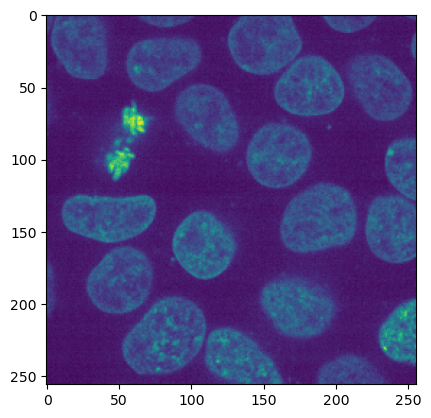
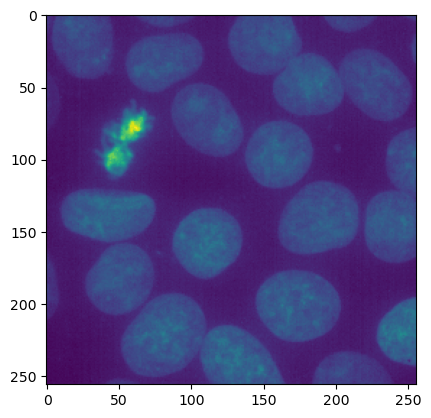

+++
title = "My notebook title"
date = "2018-06-01"
author = "firstname lastname"
categories = ["category1", "category2"]
tags = ["tag1", "tag2", "tag3"]
+++


# Post title


```python
from skimage import data
import matplotlib.pyplot as plt
import numpy as np

image = data.cells3d()

```


```python
print (image.shape)
```

    (60, 2, 256, 256)


```python
plt.imshow(image[40,1,:,:])

```


    <matplotlib.image.AxesImage at 0x17ace13f0>





    


```python
nucl_img_all = image[:,1,:,:]
nucl_img_sel = image[25:40,1,:,:]
print(nucl_img.shape)

mean_nucl_img = np.mean(nucl_img, axis=0)
mean_nucl_sel = np.mean(nucl_img_sel, axis= 0)
```

    (60, 256, 256)


```python
plt.imshow(mean_nucl_img)
```


    <matplotlib.image.AxesImage at 0x17a97b880>


    

    


```python
plt.imshow(mean_nucl_sel)
```


    <matplotlib.image.AxesImage at 0x17de4bac0>


    

    


```python

```
